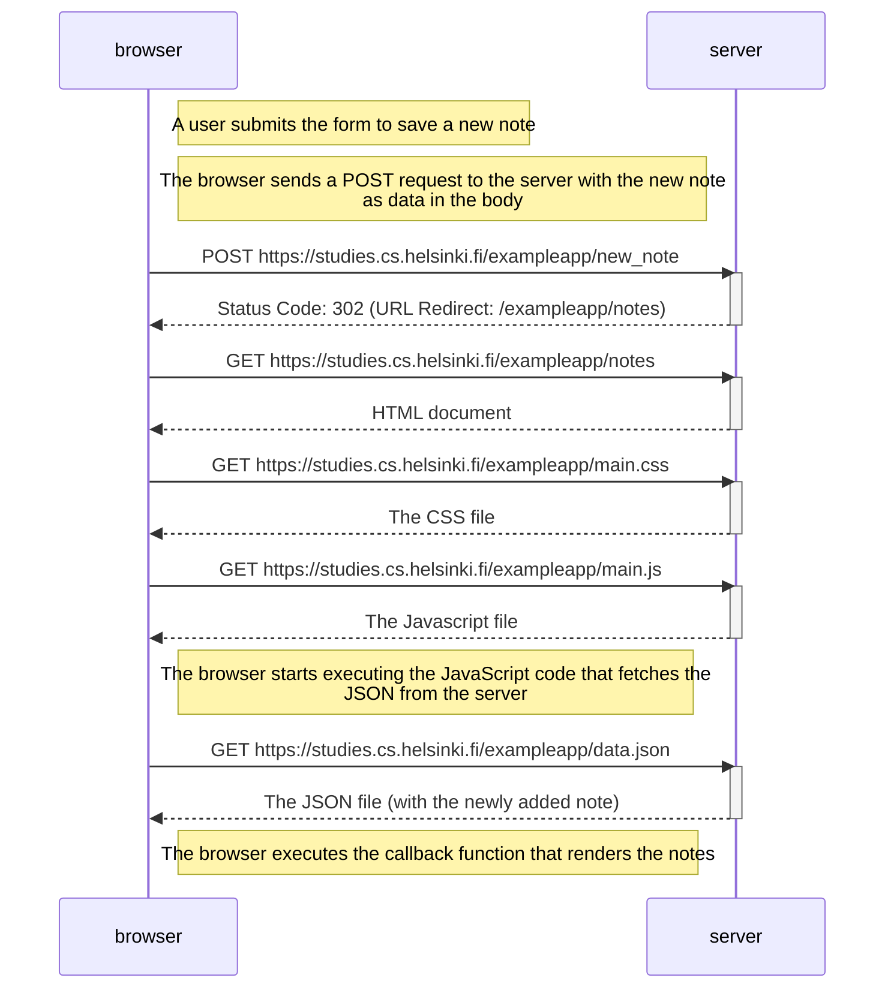

# Part 0.4: New Note Sequence Diagram

```
sequenceDiagram
    participant browser
    participant server

    Note right of browser: A user submits the form to save a new note 
    Note right of browser: The browser sends a POST request to the server with the new note<br/> as data in the body

    browser->>server: POST https://studies.cs.helsinki.fi/exampleapp/new_note
    activate server
    server-->>browser: Status Code: 302 (URL Redirect: /exampleapp/notes)
    deactivate server

    browser->>server: GET https://studies.cs.helsinki.fi/exampleapp/notes
    activate server
    server-->>browser: HTML document
    deactivate server

    browser->>server: GET https://studies.cs.helsinki.fi/exampleapp/main.css
    activate server
    server-->>browser: The CSS file
    deactivate server

    browser->>server: GET https://studies.cs.helsinki.fi/exampleapp/main.js
    activate server
    server-->>browser: The Javascript file
    deactivate server

    Note right of browser: The browser starts executing the JavaScript code that fetches the<br/> JSON from the server

    browser->>server: GET https://studies.cs.helsinki.fi/exampleapp/data.json
    activate server
    server-->>browser: The JSON file (with the newly added note)
    deactivate server

    Note right of browser: The browser executes the callback function that renders the notes
```