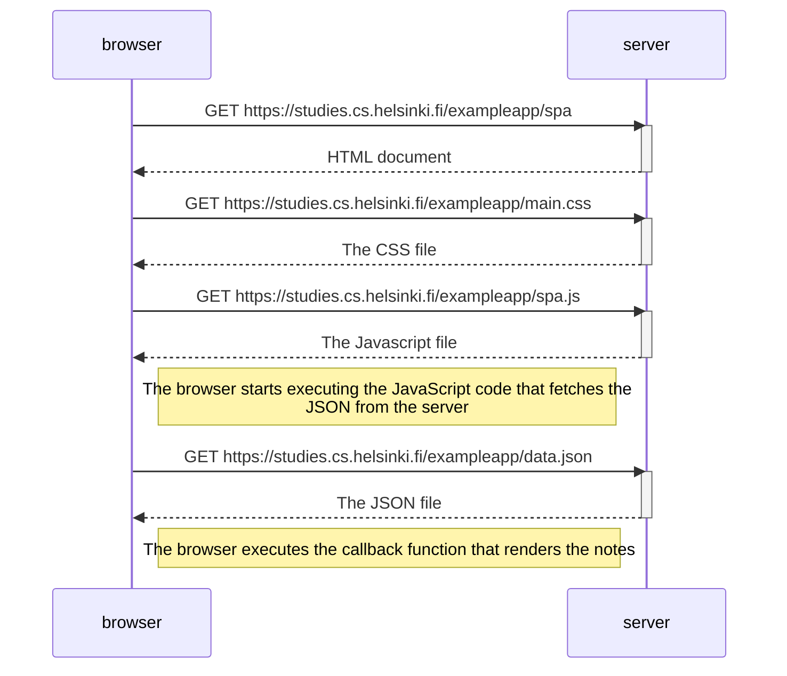

# Part 0.5: Single Page App Sequence Diagram

```
sequenceDiagram
    participant browser
    participant server

    browser->>server: GET https://studies.cs.helsinki.fi/exampleapp/spa
    activate server
    server-->>browser: HTML document
    deactivate server

    browser->>server: GET https://studies.cs.helsinki.fi/exampleapp/main.css
    activate server
    server-->>browser: The CSS file
    deactivate server

    browser->>server: GET https://studies.cs.helsinki.fi/exampleapp/spa.js
    activate server
    server-->>browser: The Javascript file
    deactivate server

    Note right of browser: The browser starts executing the JavaScript code that fetches the<br/> JSON from the server
    
    browser->>server: GET https://studies.cs.helsinki.fi/exampleapp/data.json
    activate server
    server-->>browser: The JSON file
    deactivate server

    Note right of browser: The browser executes the callback function that renders the notes
```