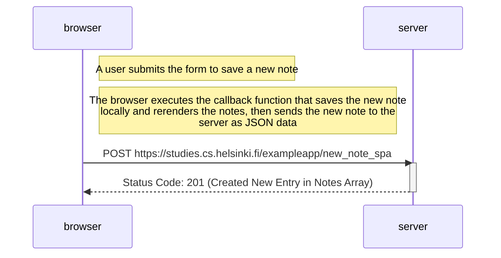

# Part 0.6: New Note in Single Page App Sequence Diagram

```
sequenceDiagram
    participant browser
    participant server
    
    Note right of browser: A user submits the form to save a new note

    Note right of browser: The browser executes the callback function that saves the new note<br/> locally and rerenders the notes, then sends the new note to the<br/> server as JSON data

    browser->>server: POST https://studies.cs.helsinki.fi/exampleapp/new_note_spa
    activate server
    server-->>browser: Status Code: 201 (Created New Entry in Notes Array)
    deactivate server
```